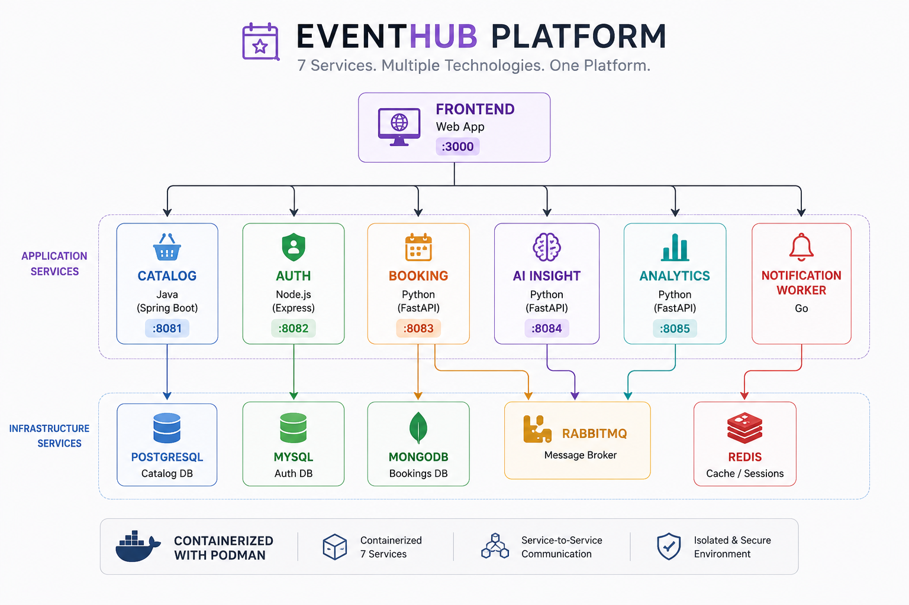

# 🎟️ EventHub Platform

A containerized **Event Management Platform** built as a multi-service application and deployed on **Red Hat OpenShift**.

This project was developed as a hands-on application of the concepts learned during the **Red Hat OpenShift Development I: Introduction to Containers with Podman (DO188 – RHA), Version 4.18** course.

The project demonstrates the journey from **containerizing individual services with Podman** to **deploying and orchestrating the complete application using OpenShift and Kubernetes**.

---

## 🏗️ Architecture




The platform consists of **7 application services** supported by multiple infrastructure components.

### Application Services

| Service | Technology | Port | Responsibility |
|---|---|---:|---|
| Frontend | Node.js | `3000` | User interface |
| Catalog | Java / Spring Boot | `8081` | Event and catalog management |
| Auth | Node.js / Express | `8082` | Authentication and authorization |
| Booking | Python / FastAPI | `8083` | Event booking management |
| AI Insight | Python / FastAPI | `8084` | AI-based booking insights |
| Analytics | Python / FastAPI | `8085` | Analytics and reporting |
| Notification Worker | Go | — | Asynchronous notifications |

### Infrastructure

- **PostgreSQL** — Catalog database
- **MySQL** — Authentication database
- **MongoDB** — Booking database
- **RabbitMQ** — Message broker for asynchronous communication
- **Redis** — Caching and session management

---

## 🐳 Containerization with Podman

The first stage of the project focused on containerization using **Podman**.

Each application service was packaged into its own container image, allowing the services and their dependencies to run in isolated and reproducible environments.

During this phase, I worked with:

- Building container images
- Running and managing containers
- Container networking
- Environment variables
- Container-to-container communication
- Persistent storage
- Debugging and troubleshooting containers
- Managing multi-service applications

The services were tested locally as a distributed containerized application before moving to orchestration.

---

## ☸️ Deployment with OpenShift

After containerizing the application, the project was deployed on **Red Hat OpenShift**, a Kubernetes-based container platform.

Instead of manually managing individual containers, OpenShift was used to deploy and orchestrate the application components.

The OpenShift deployment introduced concepts such as:

- **Pods**
- **Deployments**
- **Services**
- **ConfigMaps**
- **Secrets**
- **PersistentVolumeClaims**
- **Routes**
- Application scaling and management

This phase demonstrated how containerized services can be managed as a complete application using Kubernetes-based orchestration.

---

## 🔄 From Containers to Orchestration

The project followed a progression from individual containers to a fully orchestrated application:

```text
Application Services
        ↓
Containerization
        ↓
Podman
        ↓
Multi-Service Application
        ↓
OpenShift
        ↓
Kubernetes Orchestration
